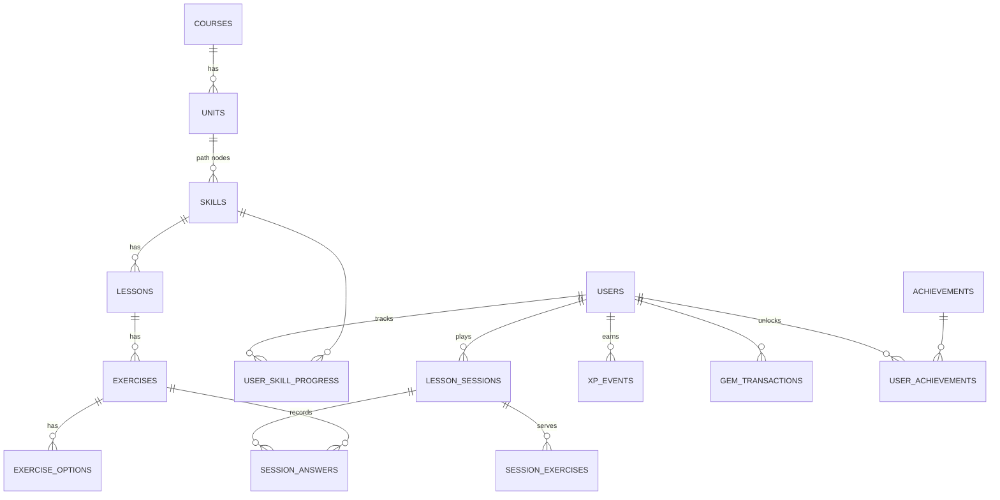

# Duolingo Clone

A full-stack clone of the Duolingo web app. It covers the learning path, the lesson loop with six exercise types, and the gamification layer (XP, streaks, hearts, gems, daily goal, quests, leagues and achievements). The course is a small seeded Spanish course for English speakers.

- **Frontend:** Next.js 16 (App Router) · React 19 · TypeScript · Tailwind CSS v4
- **Backend:** Python 3.11 · FastAPI · SQLAlchemy 2 · Pydantic 2
- **Database:** SQLite (schema below), seeded automatically on first start

> **Live demo:** _add your Vercel URL here_ · **API docs:** _add your Render URL_/docs

---

## Features

### Learning path
- Winding path of units and nodes, with a sticky unit banner and a **Guidebook** modal of grammar tips.
- Nodes can be completed, active or locked. The active node has a **progress ring** (lessons done out of total) and a bouncing START/CONTINUE bubble.
- Node types: skills (3 lessons each), **treasure chests** (gems), and a **unit review** trophy.
- Clicking a node opens the Duolingo-style popover: *Start +10 XP*, *Practice +5 XP*, *Legendary +40 XP*, or *Locked*.
- Completed skills turn gold with a crown once they reach **Legendary**.

### Lesson player (the core loop)
- Exercise types:
  - **Multiple choice**, as picture cards or "Select the correct meaning"
  - **Translate with a word bank** (tap the words)
  - **Match pairs**
  - **Fill in the blank**
  - **Type the answer**, with accent buttons
  - **Tap what you hear**, using text-to-speech with normal and slow playback
- Instant feedback in the signature green or red bottom bar ("Correct solution: …"), plus synthesized sound effects.
- Progress bar with an "N IN A ROW" combo, and **hearts** in the header with a pulse when one is lost.
- Wrong answers go back into the queue as **"Previous mistake"**. A lesson only ends once every exercise has been answered correctly, as in Duolingo.
- **Out of hearts** modal with three options: refill with gems and keep going in the same lesson, practice to earn a heart, or quit (which fails the lesson).
- **Quit** confirmation ("Wait, don't go!"), plus **Skip** and **Can't listen now**.
- End screens:
  - **Lesson complete**, with Total XP, accuracy and time cards and confetti
  - **Streak extended**, with a flame and a week strip
  - **Daily goal reached** and **Achievement unlocked**
- Keyboard support: number keys pick answers and Enter checks or continues.

### Gamification and progress
- **XP**: 10 per lesson, +5 for a perfect lesson, 15 for a unit review, 5 for practice, 40 for legendary.
- **Streaks**:
  - Grow once per local calendar day.
  - Break after a missed day unless a **streak freeze** is equipped (one freeze covers one missed day).
- **Hearts**:
  - 5 maximum; you lose one per wrong answer in lessons.
  - They **regenerate at 1 every 4 hours**, computed lazily.
  - Refill for 350 gems, or earn one by completing a practice session.
- **Gems**: earned from chests, spent in the **Shop** (heart refill, streak freeze).
- **Daily goal**: 10, 20, 30 or 50 XP, shown in the daily quests.
- **Daily quests**, derived live from today's activity.
- **Leaderboard**: a weekly Bronze league with promotion and demotion zones. 14 seeded rivals "play" deterministically as time passes, so the ranking stays alive.
- **Achievements**: 8 tiered achievements (Wildfire, Sage, Scholar, Sharpshooter, Conqueror, Champion, Legendary, Overachiever), each with levels and progress bars.
- **Profile**: stats, a chart of the last 7 days of XP, and achievements.
- **Legendary challenge**: a timed (3 min), 3-mistake challenge for a finished skill.
- **Practice hub**: mixed review plus legendary challenges.
- All progress is persisted per user in SQLite.

### Experience
- Duolingo's palette, Nunito font (the closest free match to DIN Round), chunky 3D "lip" buttons, and an original SVG owl mascot with moods (idle, happy, cheer, sad, wink).
- **Dark mode** (Off / On / System), applied before first paint with no flash.
- **Responsive**:
  - Desktop has three columns (sidebar, path, right rail).
  - Tablet has an icon-only sidebar.
  - Mobile has a top stats bar and a bottom tab bar.
- Placeholders ("Coming soon"): Super subscription, speaking practice, stories, friends, notifications, extra courses.

---

## Getting started

Prerequisites: **Python 3.11+** and **Node.js 20+**.

### 1. Backend (http://localhost:8000)

```bash
cd backend
python -m venv .venv
# Windows: .venv\Scripts\activate     macOS/Linux: source .venv/bin/activate
pip install -r requirements.txt
uvicorn app.main:app --reload --port 8000
```

The SQLite database (`backend/duolingo.db`) is created and seeded on first start. Interactive API docs are at http://localhost:8000/docs.

- Reset to the seed data at any time: `python -m app.seed.seed` (or use **Settings → Developer tools → Reset demo data**).
- Run the tests: `pytest` (31 tests cover the rules and the full HTTP lesson loop).

### 2. Frontend (http://localhost:3000)

```bash
cd frontend
cp .env.example .env.local   # NEXT_PUBLIC_API_URL=http://localhost:8000
npm install
npm run dev
```

Open http://localhost:3000. You're logged in as **Alex**, the seeded learner. Alex is a few days into the course: a 3-day streak (last practiced yesterday), 4 hearts and 520 gems, with Unit 1 partly done.

### Testing streaks and heart regeneration
Go to **Settings → Developer tools** to move the learner's clock forward by +1 hour, +4 hours, +1 day or +2 days. Things to watch:
- Hearts regenerate as time passes.
- Skipping a day uses up the streak freeze.
- Skipping another day breaks the streak.
- The league rivals keep earning XP.

---

## Architecture

```
┌──────────────────────── Next.js (frontend/) ────────────────────────┐
│ app/(main)/*   learn · practice · leaderboard · quests · shop ·     │
│                profile · settings  (shared layout: sidebar + rail)  │
│ app/lesson     full-screen lesson player                            │
│ components/    path/ · lesson/ (player, exercises, screens) ·       │
│                layout/ · ui · icons · Mascot                         │
│ lib/           api.ts (typed client) · types.ts · sound · speech ·  │
│                theme · format · useApi                              │
└───────────────────────────────┬─────────────────────────────────────┘
                                │ JSON over HTTP (REST)
┌───────────────────────────────▼──────── FastAPI (backend/) ─────────┐
│ routers/   me · course · sessions · gamification · dev   (thin)     │
│ services/  sessions (lesson loop) · progress (path/unlocks) ·       │
│            grading · hearts · streak · stats (goal/quests/league) · │
│            achievements · users · clock                             │
│ models.py  SQLAlchemy ORM    schemas.py  Pydantic contracts         │
│ seed/      content.py (course data) → builder.py (exercises)        │
└───────────────────────────────┬─────────────────────────────────────┘
                                ▼
                        SQLite (duolingo.db)
```

**Design decisions**
- **The server is authoritative.** Solutions and `is_correct` flags never reach the client before an answer is submitted. The client sends answers (option ids, tile ids, pairs or free text) and `services/grading.py` decides. Free text forgives case, punctuation, missing accents ("Pay attention to the accents") and one-letter typos. Word banks are strict.
- **Thin routers, fat services.** Routers only parse requests and commit. All gameplay rules live in small, pure-ish service modules that are unit-tested without HTTP.
- **Lazy time-based state.** Heart regeneration and missed streak days are settled on every request (`deps.get_current_user`) from timestamps, not by a background job. This makes it simple, correct after downtime, and testable.
- **A simulated clock.** Each user has a `time_offset_minutes`. `services/clock.py` is the only place that reads "now", so time travel works everywhere. Calendar days use the learner's IANA timezone, which the frontend syncs.
- **Ledgers plus cached totals.** `xp_events` and `gem_transactions` are append-only ledgers. The leaderboard, daily goal, quests, XP chart and streak calendar are derived from them, while `users.total_xp` and `gems` are cached totals for cheap reads.
- **Content is data.** The course lives in the database. `seed/content.py` holds the vocabulary and sentences, and `seed/builder.py` generates varied exercises from them deterministically: 12 skills × 3 lessons × 9 exercises, plus 3 unit reviews, for 354 exercises in total.
- **Frontend state.** `AppStateProvider` holds the learner (`/api/me`) and toasts. Pages fetch their own data with a small `useApi` hook. The lesson player is a self-contained state machine: queue → answering → checking → feedback → complete screens.
- **No external UI or asset libraries.** Icons, the mascot, confetti and sounds (Web Audio) are hand-written. Speech uses the browser's Web Speech API.

---

## Database schema



| Table | Purpose | Key columns |
|---|---|---|
| `courses` | A language course | `learning_language`, `from_language`, `title`, `flag` (unique language pair) |
| `units` | Sections of the path | `course_id`, `position`, `title`, `color`, `guidebook` |
| `skills` | Path nodes | `unit_id`, `position`, `kind` ∈ {skill, chest, review}, `title`, `icon` |
| `lessons` | Levels of a skill | `skill_id`, `position` |
| `exercises` | One challenge | `lesson_id`, `position`, `type` ∈ {multiple_choice, translate, match_pairs, fill_blank, type_answer, listen}, `instruction`, `prompt`, `hint`, `solution`, `accepted_answers` (JSON) |
| `exercise_options` | Choices, word-bank tiles or match pairs | `exercise_id`, `text`, `image`, `is_correct`, `pair_key`, `side` |
| `users` | Learner and seeded rivals | `total_xp`, `gems`, `hearts`, `hearts_updated_at`, `streak_count`, `longest_streak`, `last_streak_date`, `streak_freezes`, `daily_goal_xp`, `timezone`, `time_offset_minutes`, `is_bot`, `bot_activity` |
| `user_skill_progress` | Per-user node progress | `lessons_completed`, `completed_at`, `is_legendary`, `practice_count` (unique user+skill) |
| `lesson_sessions` | One play-through | `mode` ∈ {lesson, practice, legendary}, `status` ∈ {in_progress, completed, failed, abandoned}, `mistakes`, `hearts_lost`, `xp_earned`, `accuracy` |
| `session_exercises` | Ordered exercises served in a session (practice mixes lessons) | `session_id`, `exercise_id`, `position` |
| `session_answers` | Every submitted answer | `answer` (JSON), `is_correct`, `answered_at` |
| `xp_events` | XP ledger | `amount`, `source`, `activity_date` (learner's local date), `session_id` |
| `gem_transactions` | Gem ledger | `amount` (±), `reason` |
| `achievements` / `user_achievements` | Tiered achievements and unlocked levels | `metric`, `thresholds` (JSON) / `level`, `unlocked_at` |

Integrity is enforced with foreign keys (turned on for SQLite), unique constraints (for example one progress row per user and skill, and unique positions) and `CHECK` constraints (enum-like columns, 0 ≤ hearts ≤ 5, gems ≥ 0). Hot query paths have composite indexes on `(user_id, activity_date)` and `(user_id, status)`.

---

## API overview

All endpoints are under `/api` and return JSON. Errors look like `{"code": "out_of_hearts", "detail": "…"}`, so the UI can react to the machine-readable `code`. The full OpenAPI spec is at `/docs`.

| Method | Path | Description |
|---|---|---|
| GET | `/me` | Learner state: XP, gems, hearts and next-heart time, streak, daily goal, settings |
| PATCH | `/me/settings` | Update name, daily goal, sound, listening, timezone |
| GET | `/profile` | Stats, achievements, XP for the last 7 days, streak week |
| GET | `/path` | Units → nodes, each with a state (completed/active/locked) and lesson progress |
| GET | `/units/{id}/guidebook` | Unit tips |
| POST | `/skills/{id}/chest` | Open the active chest (+gems) |
| POST | `/sessions` | Start `{skill_id, mode}` → session with exercises (no solutions) |
| POST | `/sessions/{id}/answers` | `{exercise_id, answer}` → `{correct, solution, note, hearts, …}` (`answer: null` = skip) |
| POST | `/sessions/{id}/skip-listening` | "Can't listen now" (no penalty) |
| POST | `/sessions/{id}/complete` | Award XP and update progress, streak, goal and achievements → summary |
| POST | `/sessions/{id}/abandon` | Quit (counts as failed if out of hearts) |
| GET | `/leaderboard` | Weekly league with zones |
| GET | `/quests` | Today's quests |
| GET | `/shop` · POST `/shop/purchase` | Heart refill and streak freeze, paid with gems |
| POST | `/dev/time-travel` · `/dev/reset` | Simulate time passing and reset seed data (switch off with `ENABLE_DEV_TOOLS=false`) |

---

## Deployment

**Backend on Render** (`render.yaml` Blueprint, or `backend/Dockerfile` for any container host):
1. Create a new Blueprint from the repository. Render reads `render.yaml`, whose root is `backend/`.
2. Once it's live, set `CORS_ORIGINS` to your frontend URL.

**Frontend on Vercel:**
1. Import the repository with **Root Directory** set to `frontend`.
2. Set `NEXT_PUBLIC_API_URL=https://<your-render-service>.onrender.com`.
3. Deploy.

> On free hosting, SQLite lives on an ephemeral disk, so the demo reseeds itself after a redeploy or restart. For durable storage, attach a persistent disk and point `DATABASE_URL` at it.

---

## Assumptions and simplifications
- **Authentication is out of scope.** The default learner (id 1) is always logged in. `X-User-Id` lets tests act as another user.
- **One seeded course** (Spanish from English) with 3 units, 12 skills, 3 chests and 3 unit reviews.
- **Rivals:** the 14 league rivals are seeded bots whose weekly XP is generated deterministically per day.
- **Audio:** browser text-to-speech stands in for recorded audio, and speech recognition is a placeholder.
- **Purchases:** gems are mocked, with no real payments, and Super is a "coming soon" placeholder.
- **Match pairs:** mismatches don't cost hearts (as in Duolingo). Skipping an exercise counts as a mistake.
- **Streaks:** a streak extends on any completed lesson or practice, not only when the daily goal is met, which matches Duolingo's behaviour.
- **Branding:** the name "duolingo" appears as text only to match the look and feel for this assignment. The mascot, icons and all other assets are original drawings.
